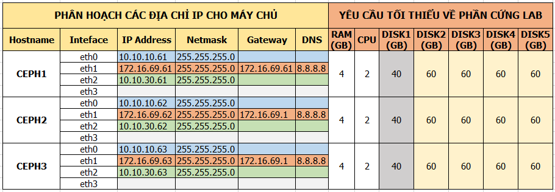

# Hướng dẫn cài đặt CEPH JEWEL trên Ubuntu 14.04
Mục lục:

- [1. Các bước chuẩn bị](#1)
  - [1.1. Mô hình LAB](#1.1)
  - [1.2. Phân hoạch IP và phần cứng yêu cầu đối với mô hình LABs](#1.2)
- [2. Thiết lập ip, hostname cho các máy chủ CEPH](#2)
  - [2.1. Thiết lập ip, hostname cho các máy chủ CEPH](#2.1)
  - [2.2. Thiết lập ip, hostname cho các máy chủ CEPH](#2.2)
  - [2.3. Thiết lập ip, hostname cho các máy chủ CEPH](#2.3)

========================

<a name="1"></a>
## 1 Các bước chuẩn bị

<a name="1.1"></a>
### 1.1 Mô hình LAB


- Cấu hình các máy

```sh
- Gồm 03 máy chủ là: CEPH1, CEPH2, CEPH3
- OS: Ubuntu Server 14.04 64bit
- RAM: thấp nhất 04 GB
- Máy có 03 NICs: 
-- eth0: sử dụng để quản trị các máy chủ CEPH (dùng chế độ hostonly -vmnet10 của Vmware workstation)
-- eth1: sử dụng để tải gói cài đặt từ internet (dụng NAT hoặc Bridge của Vmware workstation)
-- eth2: sử dụng để cho các máy chủ CEPH Replicate dữ liệu (dùng chế độ hostonly - vmnet12- của Vmware workstation)

- Sử dụng 05 ổ cứng, bao gồm:
-- HDD1: Cài OS Ubuntu Server 14.04 64bit
-- HDD2 đến HDD5: Cung cấp các OSD cho CEPH.
```

Chú ý: Số Node (Mon+Osd) nên cấu hình là 3 node để số lượng Object đc replicate đúng. Có thể cấu hình 1 node, dùng bình thường nhưng check ceph status sẽ báo pgs degrate.

<a name="1.2"></a>
###  1.2 Phân hoạch IP và phần cứng yêu cầu đối với mô hình LABs



<a name="2"></a>
## 2 Thiết lập ip, hostname cho các máy chủ CEPH

<a name="2.1"></a>
### 2.1 Thiết lập IP và hostname cho CEPH1
Các bước này sẽ cấu hình IP và hostname, phân giải tên cho các node cho CEPH1 đúng như mô hình trên

- Sao lưu cấu hình IP trước khi thay đổi

```sh
cp /etc/network/interfaces /etc/network/interfaces.orgi
```

- Khai báo các card mạng theo ip đã phân hoạch

```sh
cat <<EOF> /etc/network/interfaces

# The loopback network interface
auto lo
iface lo inet loopback

# MGNT for CEPH
auto eth0
iface eth0 inet static
address 10.10.10.61
netmask 255.255.255.0 

# INTERNET for CEPH
auto eth1
iface eth1 inet static
address 172.16.69.61
netmask 255.255.255.0
gateway 172.16.69.1
dns-nameservers 8.8.8

# CEPH replicate 
auto eth2
iface eth2 inet static
address 10.10.30.61
netmask 255.255.255.0 
EOF
```

- Thiết lập hostname cho `CEPH1`

```sh
echo "ceph1" > /etc/hostname
hostname -F /etc/hostname
```

- Cấu hình phân giải tên cho các node CEPH trên host1

```sh
cp /etc/hosts /etc/hosts.orig
cat << EOF > /etc/hosts
127.0.0.1       localhost ceph1
10.10.10.61    	ceph1
10.10.10.62  	ceph2
10.10.10.63 	ceph3
EOF
```

<a name="2.2"></a>
### 2.2. Thiết lập IP và hostname cho CEPH2
Các bước này sẽ cấu hình IP và hostname, phân giải tên cho các node cho CEPH2 đúng như mô hình trên

- Sao lưu cấu hình IP trước khi thay đổi.

```sh
cp /etc/network/interfaces /etc/network/interfaces.orgi
```

- Khai báo các card mạng theo ip đã phân hoạch

```sh
cat <<EOF> /etc/network/interfaces

# The loopback network interface
auto lo
iface lo inet loopback

# MGNT for CEPH
auto eth0
iface eth0 inet static
address 10.10.10.62
netmask 255.255.255.0 

# INTERNET for CEPH
auto eth1
iface eth1 inet static
address 172.16.69.62
netmask 255.255.255.0
gateway 172.16.69.1
dns-nameservers 8.8.8

# CEPH replicate 
auto eth2
iface eth2 inet static
address 10.10.30.62
netmask 255.255.255.0 
EOF
```

- Thiết lập hostname cho `CEPH2`

```sh
echo "ceph2" > /etc/hostname
hostname -F /etc/hostname
```

- Cấu hình phân giải tên của các máy chủ

```sh
cp /etc/hosts /etc/hosts.orig
cat << EOF > /etc/hosts
127.0.0.1       localhost ceph2
10.10.10.61    	ceph1
10.10.10.62  	ceph2
10.10.10.63 	ceph3
EOF
```

<a name="2.3"></a>
### 2.3. Thiết lập IP và hostname cho CEPH3
Các bước này sẽ cấu hình IP và hostname, phân giải tên cho các node cho CEPH3 đúng như mô hình trên

- Sao lưu cấu hình IP trước khi thay đổi

	```sh
	cp /etc/network/interfaces /etc/network/interfaces.orgi
	```

- Khai báo các card mạng theo ip đã phân hoạch
```sh
cat <<EOF> /etc/network/interfaces

# The loopback network interface
auto lo
iface lo inet loopback

# MGNT for CEPH
auto eth0
iface eth0 inet static
address 10.10.10.63
netmask 255.255.255.0 

# INTERNET for CEPH
auto eth1
iface eth1 inet static
address 172.16.69.63
netmask 255.255.255.0
gateway 172.16.69.1
dns-nameservers 8.8.8

# CEPH replicate 
auto eth2
iface eth2 inet static
address 10.10.30.63
netmask 255.255.255.0 
EOF
```

- Thiết lập hostname cho `CEPH3`
```sh
echo "ceph3" > /etc/hostname
hostname -F /etc/hostname
```

- Cấu hình phân giải tên cho các node CEPH
```sh
cp /etc/hosts /etc/hosts.orig
cat << EOF > /etc/hosts
127.0.0.1       localhost ceph3
10.10.10.61    	ceph1
10.10.10.62  	ceph2
10.10.10.63 	ceph3
EOF
```

## 3. Cài đặt CEPH lên các máy chủ.
- Các bước chính cài đặt CEPH 

### 3.1. Cài đặt CEPH trên node `ceph1`
- Các thành phần được cài trên CEPH1

### 3.2. Cài đặt CEPH trên node `ceph2`
- Các thành phần được cài trên CEPH2

### 3.3. Cài đặt CEPH trên node `ceph3`
- Các thành phần được cài trên CEPH3