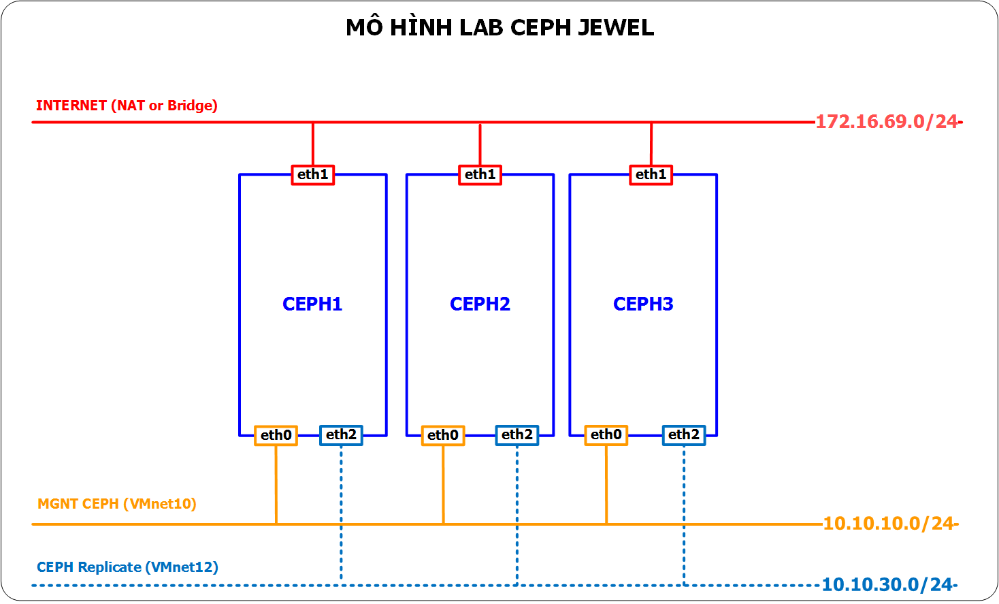
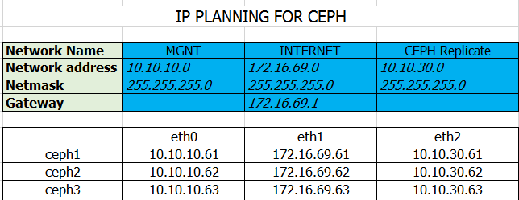

# Hướng dẫn cài đặt CEPH JEWEL trên Ubuntu 14.04
Mục lục:

[I. Mô hình Lab](#1)

========================

<a name="1"></a>
## 1. Các bước chuẩn bị
### 1.1. Mô hình



- Cấu hình các máy

```sh
- Gồm 03 máy chủ là: CEPH1, CEPH2, CEPH3
- OS: Ubuntu Server 14.04 64bit
- RAM: thấp nhất 04 GB
- Máy có 03 NICs: 
-- eth0: sử dụng để quản trị các máy chủ CEPH (dùng chế độ hostonly -vmnet10 của Vmware workstation)
-- eth1: sử dụng để tải gói cài đặt từ internet (dụng NAT hoặc Bridge của Vmware workstation)
-- eth2: sử dụng để cho các máy chủ CEPH Replicate dữ liệu (dùng chế độ hostonly - vmnet12- của Vmware workstation)

- Sử dụng 05 ổ cứng, bao gồm:
-- HDD1: Cài OS Ubuntu Server 14.04 64bit
-- HDD2 đến HDD5: Cung cấp các OSD cho CEPH.
```

Chú ý: Số Node (Mon+Osd) nên cấu hình là 3 node để số lượng Object đc replicate đúng. Có thể cấu hình 1 node, dùng bình thường nhưng check ceph status sẽ báo pgs degrate.

###  1.2. IP Planning



## 2. Thiết lập ip, hostname cho các máy chủ CEPH
### 2.1 Thiết lập IP và hostname cho CEPH1
- Cấu hình IP và hostname cho CEPH1 đúng như mô hình trên

- Sao lưu cấu hình IP trước khi thay đổi
	```sh
	cp /etc/network/interfaces /etc/network/interfaces.orgi
	```

- Khai báo các card mạng theo ip đã phân hoạch
	```sh
	cat <<EOF> /etc/network/interfaces

	# The loopback network interface
	auto lo
	iface lo inet loopback

	# MGNT for CEPH
	auto eth0
	iface eth0 inet static
	address 10.10.10.61
	netmask 255.255.255.0 

	# INTERNET for CEPH
	auto eth1
	iface eth1 inet static
	address 172.16.69.61
	netmask 255.255.255.0
	gateway 172.16.69.1
	dns-nameservers 8.8.8

	# CEPH replicate 
	auto eth2
	iface eth2 inet static
	address 10.10.30.61
	netmask 255.255.255.0 
	EOF

- Thiết lập hostname cho `CEPH1`
	```sh
	echo "ceph1" > /etc/hostname
	hostname -F /etc/hostname
	```

- Cấu hình phân giải tên cho các node CEPH trên host1
	```sh
	cp /etc/hosts /etc/hosts.orig
	cat << EOF > /etc/hosts
	127.0.0.1       localhost ceph1
	10.10.10.61    	ceph1
	10.10.10.62  	ceph2
	10.10.10.63 	ceph3
	EOF
	```


### 2.2 Thiết lập IP và hostname cho CEPH2
- Cấu hình IP và hostname cho CEPH1 đúng như mô hình trên

- Sao lưu cấu hình IP trước khi thay đổi
	```sh
	cp /etc/network/interfaces /etc/network/interfaces.orgi
	```

- Khai báo các card mạng theo ip đã phân hoạch
	```sh
	cat <<EOF> /etc/network/interfaces

	# The loopback network interface
	auto lo
	iface lo inet loopback

	# MGNT for CEPH
	auto eth0
	iface eth0 inet static
	address 10.10.10.62
	netmask 255.255.255.0 

	# INTERNET for CEPH
	auto eth1
	iface eth1 inet static
	address 172.16.69.62
	netmask 255.255.255.0
	gateway 172.16.69.1
	dns-nameservers 8.8.8

	# CEPH replicate 
	auto eth2
	iface eth2 inet static
	address 10.10.30.62
	netmask 255.255.255.0 
	EOF

- Thiết lập hostname cho `CEPH1`
	```sh
	echo "ceph2" > /etc/hostname
	hostname -F /etc/hostname
	```

- Cấu hình phân giải tên cho các node CEPH
	```sh
	cp /etc/hosts /etc/hosts.orig
	cat << EOF > /etc/hosts
	127.0.0.1       localhost ceph2
	10.10.10.61    	ceph1
	10.10.10.62  	ceph2
	10.10.10.63 	ceph3
	EOF
	```


### 2.3. Thiết lập IP và hostname cho CEPH3
- Cấu hình IP và hostname cho CEPH1 đúng như mô hình trên

- Sao lưu cấu hình IP trước khi thay đổi
	```sh
	cp /etc/network/interfaces /etc/network/interfaces.orgi
	```

- Khai báo các card mạng theo ip đã phân hoạch
	```sh
	cat <<EOF> /etc/network/interfaces

	# The loopback network interface
	auto lo
	iface lo inet loopback

	# MGNT for CEPH
	auto eth0
	iface eth0 inet static
	address 10.10.10.63
	netmask 255.255.255.0 

	# INTERNET for CEPH
	auto eth1
	iface eth1 inet static
	address 172.16.69.63
	netmask 255.255.255.0
	gateway 172.16.69.1
	dns-nameservers 8.8.8

	# CEPH replicate 
	auto eth2
	iface eth2 inet static
	address 10.10.30.63
	netmask 255.255.255.0 
	EOF

- Thiết lập hostname cho `CEPH1`
	```sh
	echo "ceph3" > /etc/hostname
	hostname -F /etc/hostname
	```

- Cấu hình phân giải tên cho các node CEPH
	```sh
	cp /etc/hosts /etc/hosts.orig
	cat << EOF > /etc/hosts
	127.0.0.1       localhost ceph3
	10.10.10.61    	ceph1
	10.10.10.62  	ceph2
	10.10.10.63 	ceph3
	EOF
	```

## 3. Cài đặt CEPH lên các máy chủ.
- Các bước chính cài đặt CEPH 

### 3.1 Cài đặt CEPH trên node `ceph1`
- Các thành phần được cài trên CEPH1

### 3.2 Cài đặt CEPH trên node `ceph2`
- Các thành phần được cài trên CEPH2

### 3.3 Cài đặt CEPH trên node `ceph3`
- Các thành phần được cài trên CEPH3